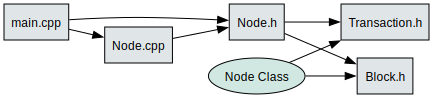

# B-wbsft
Blockchain Simulation in C++ for Charles, Utkarsh, and Jérémie.


## Assumptions
- The simulation should not allow transactions before the mining simulation is initiated, i.e., you can't call `b create-account ... ` before calling `b start-node`
- Blocks with no transactions are still stored (maintains the property that we create blocks at regular interval of 10s)
- The first block is created at T=10
- Throw an error if user attempts to create an account that already exists
- It's said that 'Ctrl+C' should end the simulation. In most terminals 'Ctrl+C' is already assigned to abort the current task and regain user control, so no command/hot-key assignment needs to be done here
- If the user calls  `b start-node` consecutively, i.e, attempts to start node when it is already running, they recieve a message notifying them that the node is already running

## Dependency Graph




## Features
- If user enters a command that doesn't begin with `b`, the program prints `<Unknown command. Must start with 'b'>` and gives an example of a valid command for starting the node
- If the command begins with `b` but is otherwise invalid, the program tells the user that the command is not recognized and prints the list of known commands to the console
- If user enters a valid command but uses the command incorrectly, i.e., not properly parameterized, the program explains the format of proper parameterization of that specific command, for example if 
you attempted to use `b create-account` incorrectly, you would see: `Usage: b create-account <account-id> <starting-balance>` which displays proper parameterization of that command

## Set-up
Clone the repository to your local machine

```git clone https://github.com/floor-licker/B-wbsft.git```

Navigate to root directory

```cd B-wbsft```

If CMake is not installed on your local machine, install CMake.

**Installing CMake on macOS**
Open a terminal and run

```
/bin/bash -c "$(curl -fsSL https://raw.githubusercontent.com/Homebrew/install/HEAD/install.sh)"
brew update
brew install cmake
```

**Installing CMake on Windows**
Open PowerShell as an administrator and run 

```
Set-ExecutionPolicy Bypass -Scope Process -Force; `
[System.Net.ServicePointManager]::SecurityProtocol = [System.Net.ServicePointManager]::SecurityProtocol -bor 3072; `
iex ((New-Object System.Net.WebClient).DownloadString('https://community.chocolatey.org/install.ps1'))
```
Then to install CMake

```
choco install cmake --installargs 'ADD_CMAKE_TO_PATH=System'
```


## Checklist

- [x] **Block Creation**
  - [x] Create new blocks every 10 seconds (T=10, T=20, T=30, etc.)

- [x] **Commands**
  - [x] **Account Creation**
    - [x] Implement `b create-account <id-of-account> <starting-balance>`
    - [x] Create a new account with the specified ID and starting balance
  - [x] **Fund Transfer**
    - [x] Implement `b transfer <from-account> <to-account> <amount>`
    - [x] Send funds from one account to another
    - [x] Error handling for insufficient funds
    - [x] Handle confirmation times based on transaction time:
      - [x] Transactions sent at T=7 take 3 seconds to confirm
      - [x] Transactions sent at T=12 take 8 seconds to confirm
  - [x] **Balance Check**
    - [x] Implement `b balance <account>`
    - [x] Immediately display the account balance

- [x] **Node Management**
  - [x] Implement `b start-node` to spin up the local blockchain server
  - [x] Allow stopping the node with Ctrl-c (This is already how most terminals abort the current task so nothing needs to be implemented)

- [x] **Error Handling**
  - [x] Display helpful error messages for incorrect command usage

- [x] **Miscellaneouss**
  - [x] Implmentation should be of the form that there is no permanent data storage; reset state upon node restart.
